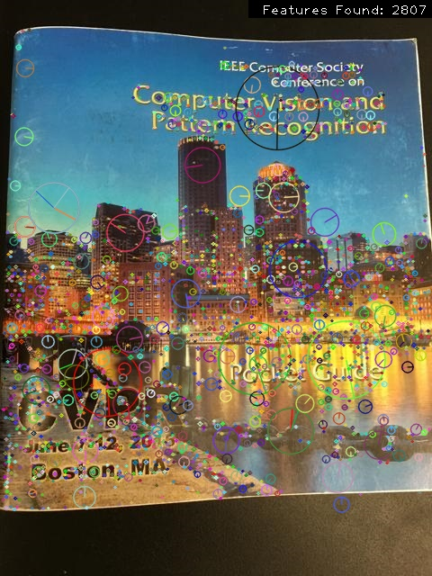
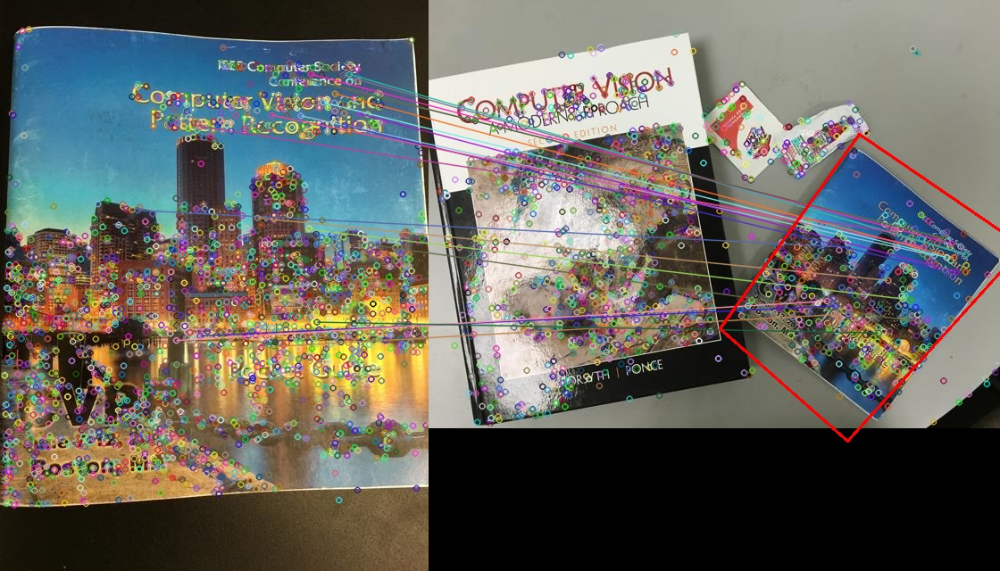
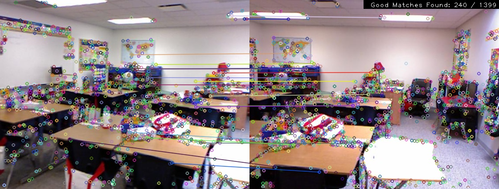
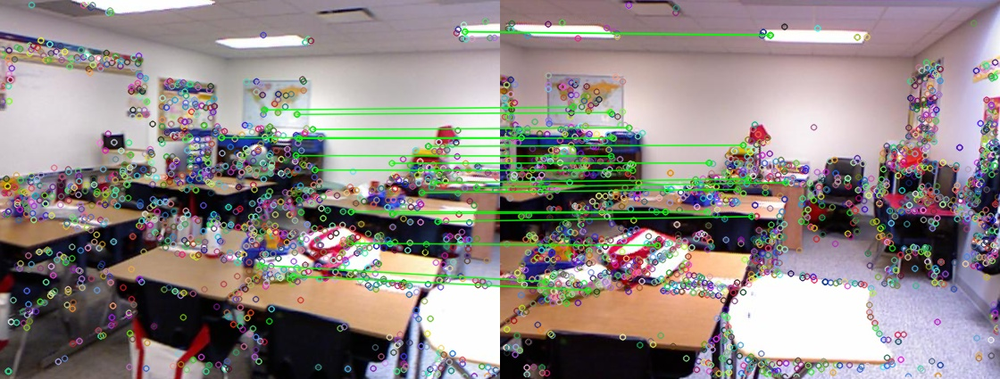
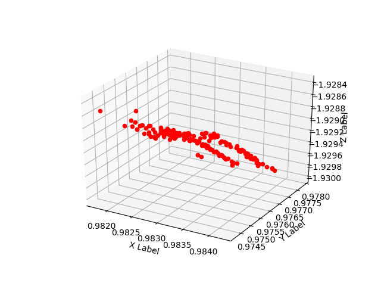

# Homography and SFM using C++
Following was a simple test to understand the SFM pipeline. Started from understanding how to build essentials from OpenCV4.0 branch, then slowly ventured into detecting SIFT features and plotting them on the given images, to finding matches with another image on scene and then there were 2 paths:

## Homography Calculation and Object Boudning Box Detection in Scene
<b>Scene Image (SIFT):</b>  


<b>Object 1 Image (SIFT):</b>  


<b>Object 2 Image (SIFT):</b>  


<b>Object 1 in Scene</b>  
[0.5416514294202881, 0.0729575686538258, 22.24947839959597;  
 -0.1019638154153684, 0.5335849908567323, 99.63156264225833;  
 -4.907759606720315e-05, -5.599438906408732e-05, 1]   
  
<b>Homography Stats:</b>  
- Inliers: 376 
- Outliers: 79  
  


<b>Object 2 in Scene</b>  
[0.2566283775759789, -0.1625235232701573, 482.7235216356567;  
 0.2120875833076415, 0.4323596462842703, 150.0643994463597;  
 -0.0001887560809912152, 0.0002476836832800081, 1] . 
  
<b>Homography Stats:</b>  
- Inliers: 174 
- Outliers: 54  
  


## SFM PIPELINE
We use a pre-computed intrinsic matrix for our tests. The following snippet creates this matrix
```
// Intrinsic Matrix
Mat intrinsicMatrix = Mat::eye(3, 3, CV_64F);
intrinsicMatrix.at<double>(0, 0) = 518.86;
intrinsicMatrix.at<double>(0, 1) = 000.00; 
intrinsicMatrix.at<double>(0, 2) = 285.58;
intrinsicMatrix.at<double>(1, 0) = 000.00;
intrinsicMatrix.at<double>(1, 1) = 519.47; 
intrinsicMatrix.at<double>(1, 2) = 213.74;
intrinsicMatrix.at<double>(2, 0) = 000.00;
intrinsicMatrix.at<double>(2, 1) = 000.00; 
intrinsicMatrix.at<double>(2, 2) = 001.00;
```

<b>Essential Matrix:</b>  
[0.05378696629533825, -0.6827534179993636, 0.05006556956767162;  
0.5754833235263019, 0.03138784169617768, -0.4046980717406783;  
-0.06685318285234208, 0.1655001926125599, 0.02533234818697279]  
   
<b>SFM Stats:</b>  
- Inliers: 181
- Outliers: 30  
  
<b>Rotation Matrix:</b>  
[0.931018313814074, 0.04680308094160224, -0.3619590735942009;  
-0.0449409421394707, 0.9988975185382386, 0.01356684111229282;  
0.3621949903883475, 0.003635804247103178, 0.9320952579350792]  
  
<b>Rotation Angles (degrees):</b>   
[-0.2912323802039411; -21.23616240185686; -2.690437118911649]  
<b>Translation:</b>  
[-0.2385295420311491; -0.09003575363325729; -0.9669525431199308]  
  
<b>SIFT feature detection on left and right camera</b>
  
  
<b>Matches consistent with Essential Matrix</b>  
  

<b>Traingulated Points</b>   
  

# Conclusions
## Homography for Object Detection in Scene
- Is extremely fast in the generation of output
- This method is adhoc. We don't need data to work with to do this kind of detection. It can't be thought of as a more advanced version of Template Matching. So the only data we need is a good image of the object itself.
- High lighting and reflective surfaces throw off SIFT. I encounted many problems with images that had severe lighting problems. Perhaps some kind of preprocessing will help.

## SFM
- The process to recover pose, i.e camera rotation and translation, seems to work well when there are good number of inliers after finding essential matrix.
* Consider Pairs A and B. The rotation in degrees seem to be very consistent with what we expect to see given the images.
* Pair C however reports that the camera on the right is rotated ~175 degrees about the x axis which would technically flip the camera and point it to the other side. This is a result of bad matches with very minimal and even the good matches that we use to calculate essential matrix aren’t as good.
* Further on Pair C, all the points consistent with the essential matrix seem to lie on a plane which ends up creating a problem when recovering pose and translation.
- On Generation of the 3D recovered points, we can kind of see that the points that appear near in camera view look near in the recovered point too and the ones that appear far do have a larger z. We have to look at it down Z in the plot.
* Notice how the all the points have almost similar Z for Pair C. This is because we started with all the points on a plane after essential matrix computation.
